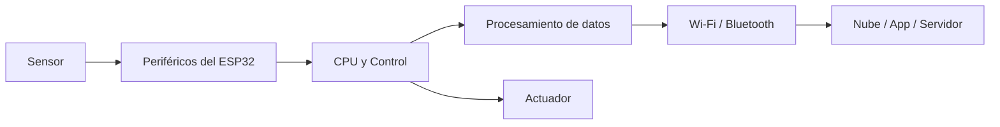
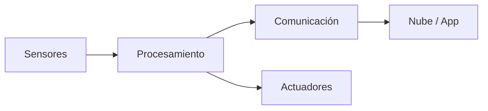

# ESP32: estructura interna y aplicación en IoT

## 1. Introducción

El **ESP32** es un microcontrolador ampliamente utilizado en aplicaciones de **sistemas embebidos** e **Internet de las Cosas (IoT)** porque integra en un solo chip capacidad de procesamiento, conectividad inalámbrica, periféricos digitales, periféricos analógicos, gestión de energía y funciones de seguridad.

A diferencia de un microcontrolador básico, el ESP32 incluye **Wi‑Fi** y **Bluetooth/BLE**, lo que permite conectar sensores y actuadores directamente a una red, a una aplicación móvil o a servicios en la nube.

En términos educativos, el ESP32 es una plataforma muy adecuada para estudiantes de Sistemas Computacionales porque permite relacionar conceptos de:

- Programación en C, Arduino o MicroPython.
- Arquitectura de microcontroladores.
- Sensores y actuadores.
- Comunicación inalámbrica.
- Protocolos de red.
- Sistemas embebidos de bajo consumo.
- Aplicaciones IoT reales.

---

## 2. Imagen general de la estructura interna

La siguiente imagen resume los principales bloques funcionales del ESP32.

El diagrama muestra que el ESP32 puede entenderse como una plataforma embebida integrada por varios subsistemas conectados alrededor de un bloque central de procesamiento.

---

## 3. Bloque central: CPU y control

En el centro del diagrama se encuentra el bloque **CPU y Control**. Este bloque representa el “cerebro” del ESP32.

El ESP32 clásico utiliza **dos núcleos Xtensa LX6**, lo que le permite ejecutar varias tareas de forma eficiente. Por ejemplo, una tarea puede encargarse de leer sensores mientras otra maneja la comunicación Wi‑Fi.

Dentro de este bloque también se encuentran:

- **Reloj / Clock:** coordina el funcionamiento interno del sistema.
- **Controlador de interrupciones:** permite responder rápidamente a eventos externos o internos, como presionar un botón, recibir datos por UART o terminar una conversión ADC.

En una aplicación IoT, este bloque ejecuta el programa principal, toma decisiones y coordina la comunicación con los demás módulos.

---

## 4. Memoria

El bloque de **memoria** almacena tanto el programa como los datos temporales que usa el ESP32.

Incluye:

| Elemento | Función |
|---|---|
| **ROM** | Contiene código interno de arranque y funciones básicas del chip. |
| **SRAM** | Almacena variables, buffers y datos temporales mientras el programa se ejecuta. |
| **RTC Memory** | Permite conservar cierta información incluso cuando el ESP32 entra en modos de bajo consumo. |
| **Flash externa SPI** | Almacena el firmware o programa principal cargado por el usuario. |

Por ejemplo, cuando se programa el ESP32 desde Arduino IDE, PlatformIO o ESP-IDF, el programa se guarda normalmente en la memoria **Flash externa**.

---

## 5. Conectividad inalámbrica

Uno de los bloques más importantes para IoT es la **conectividad inalámbrica**.

El ESP32 integra:

- **Wi‑Fi 2.4 GHz**
- **Bluetooth / BLE**

Esto permite que el sistema se comunique sin necesidad de módulos externos.

Con **Wi‑Fi**, el ESP32 puede conectarse a un router y enviar datos a internet, a un servidor local o a una plataforma en la nube.

Con **Bluetooth/BLE**, puede comunicarse con teléfonos móviles, sensores cercanos o dispositivos de bajo consumo.

### Ejemplo

Un ESP32 puede leer la temperatura de un sensor, conectarse por Wi‑Fi y enviar el dato a una página web o dashboard.

---

## 6. Gestión de energía

El bloque de **gestión de energía** es importante porque muchos sistemas IoT funcionan con batería.

Este bloque incluye:

| Elemento | Función |
|---|---|
| **RTC** | Reloj de tiempo real usado en modos de bajo consumo. |
| **Modos Sleep** | Permiten reducir el consumo de energía cuando el sistema no necesita estar completamente activo. |
| **ULP Coprocessor** | Coprocesador de ultra bajo consumo capaz de realizar tareas simples mientras la CPU principal está dormida. |

Esto es útil en aplicaciones como sensores remotos, estaciones ambientales o dispositivos portátiles.

### Ejemplo

Un ESP32 puede dormir durante varios minutos, despertar, leer un sensor, enviar datos por Wi‑Fi y volver a dormir para ahorrar batería.

---

## 7. Periféricos digitales

El bloque de **periféricos digitales** permite que el ESP32 se comunique con dispositivos externos.

Entre los principales periféricos digitales se encuentran:

| Periférico | Uso típico |
|---|---|
| **GPIO** | Entradas y salidas digitales para botones, LEDs, sensores y actuadores. |
| **Timers** | Temporizadores internos para medir tiempo o generar eventos periódicos. |
| **PWM / LEDC** | Control de brillo de LEDs, velocidad de motores o servomotores. |
| **UART** | Comunicación serial con otros módulos o microcontroladores. |
| **SPI** | Comunicación rápida con memorias, pantallas o sensores. |
| **I2C** | Comunicación con sensores y módulos usando pocos cables. |
| **I2S** | Comunicación para audio digital. |
| **CAN / TWAI** | Comunicación usada en aplicaciones industriales o automotrices. |

Estos periféricos permiten conectar el ESP32 con sensores, pantallas, módulos de comunicación, actuadores y otros microcontroladores.

---

## 8. Periféricos analógicos

El bloque de **periféricos analógicos** permite que el ESP32 interactúe con señales del mundo físico que no son simplemente 0 o 1.

Incluye:

| Periférico | Función |
|---|---|
| **ADC** | Convierte señales analógicas en valores digitales. |
| **DAC** | Genera señales analógicas a partir de valores digitales. |
| **Touch Sensors** | Permiten detectar contacto capacitivo. |
| **Hall Sensor** | Permite detectar campos magnéticos en algunas versiones del ESP32. |

### Ejemplo con ADC

Un potenciómetro entrega un voltaje variable. El ADC del ESP32 convierte ese voltaje en un número que puede ser procesado por el programa.

### Ejemplo con Touch Sensors

Se puede crear un botón táctil sin usar un botón mecánico, solamente usando una superficie conductora conectada a un pin touch.

---

## 9. Seguridad

El bloque de **seguridad** es muy importante en IoT porque los dispositivos conectados pueden enviar información sensible o controlar sistemas físicos.

El ESP32 incluye funciones como:

| Función | Descripción |
|---|---|
| **AES** | Cifrado de datos. |
| **SHA** | Funciones hash para verificar integridad. |
| **RSA** | Criptografía de clave pública. |
| **Secure Boot** | Ayuda a verificar que el firmware que arranca sea válido. |
| **Flash Encryption** | Permite cifrar el contenido almacenado en memoria Flash. |

Estas funciones ayudan a proteger el dispositivo contra modificaciones no autorizadas o lectura directa del firmware.

En una aplicación IoT profesional, la seguridad no debe verse como algo opcional, sino como parte del diseño del sistema.

---

## 10. Interfaz con el mundo exterior

En la parte inferior del diagrama aparece la **interfaz con el mundo exterior**. Esta parte representa cómo el ESP32 se conecta con el entorno físico y con otros sistemas.

Puede interactuar con:

- **Sensores:** temperatura, humedad, luz, gas, presión, movimiento.
- **Actuadores:** motores, relevadores, LEDs, buzzers, servos.
- **Red:** Wi‑Fi, Bluetooth o comunicación con otros módulos.
- **Nube:** plataformas IoT, bases de datos, dashboards.
- **App móvil:** control y monitoreo desde un teléfono.

Este bloque resume la idea principal de IoT:

> El ESP32 toma información del mundo físico, la procesa y la comunica a otros sistemas para monitorear o controlar algo.

---

## 11. Funcionamiento general del ESP32 en una aplicación IoT

El flujo típico de trabajo de un sistema IoT con ESP32 puede representarse de la siguiente manera:

### Ejemplo: estación ambiental IoT

1. El sensor mide temperatura y humedad.
2. El ESP32 lee los datos mediante GPIO, ADC, I2C o SPI.
3. La CPU procesa la información.
4. El ESP32 se conecta a internet usando Wi‑Fi.
5. Los datos se envían a un dashboard.
6. Si se supera cierto umbral, se activa un ventilador o una alarma.

---

## 12. Resumen de bloques funcionales

| Bloque | Función principal |
|---|---|
| **CPU y control** | Ejecuta el programa y coordina el sistema. |
| **Memoria** | Guarda código, variables y datos temporales. |
| **Wi‑Fi/Bluetooth** | Permite conexión inalámbrica. |
| **Gestión de energía** | Reduce consumo en aplicaciones con batería. |
| **Periféricos digitales** | Permiten comunicación con módulos externos. |
| **Periféricos analógicos** | Permiten leer señales físicas variables. |
| **Seguridad** | Protege firmware, datos y arranque del sistema. |
| **Interfaz externa** | Conecta sensores, actuadores, red, nube y aplicaciones móviles. |

---

## 13. Idea clave para estudiantes

El ESP32 es muy útil para enseñar IoT porque permite trabajar con todos los elementos principales de un sistema embebido conectado:

La idea central puede resumirse así:

> **sensores + procesamiento + comunicación + actuadores + nube**

Por eso, el ESP32 es una excelente plataforma para proyectos educativos de sistemas embebidos, automatización, monitoreo remoto, robótica básica y aplicaciones IoT.

---

## 14. Actividades sugeridas para clase

### Actividad 1: Reconocimiento del hardware

Objetivo: identificar los pines principales de una tarjeta ESP32 y relacionarlos con los bloques internos del diagrama.

Preguntas guía:

- ¿Qué pines pueden usarse como GPIO?
- ¿Qué pines permiten lectura analógica?
- ¿Qué interfaces de comunicación están disponibles?
- ¿Qué diferencia hay entre usar un pin digital y uno analógico?

### Actividad 2: Lectura de un sensor

Objetivo: leer un sensor de temperatura, humedad o luz y mostrar el valor por el monitor serial.

Bloques involucrados:

- Periféricos analógicos o digitales.
- CPU y control.
- Memoria.

### Actividad 3: Envío de datos por Wi‑Fi

Objetivo: conectar el ESP32 a una red Wi‑Fi y enviar datos a un servidor o dashboard.

Bloques involucrados:

- CPU y control.
- Conectividad inalámbrica.
- Memoria.
- Seguridad, si se usa comunicación cifrada.

### Actividad 4: Control de un actuador

Objetivo: controlar un LED, relevador, servo o motor a partir de una lectura de sensor.

Bloques involucrados:

- GPIO.
- PWM / LEDC.
- CPU y control.
- Actuadores.

---

## 15. Conclusión

El ESP32 es una plataforma compacta y poderosa para introducir a los estudiantes en sistemas embebidos e IoT. Su arquitectura integra procesamiento, conectividad, periféricos, memoria, seguridad y gestión de energía en un solo chip.

Desde el punto de vista educativo, permite iniciar con prácticas sencillas como encender un LED o leer un sensor, y avanzar hacia proyectos más completos como estaciones ambientales, sistemas de monitoreo remoto, control desde aplicaciones móviles, automatización y prototipos conectados a la nube.
