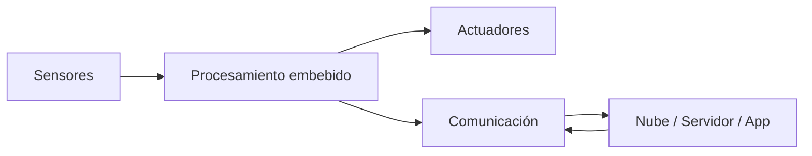
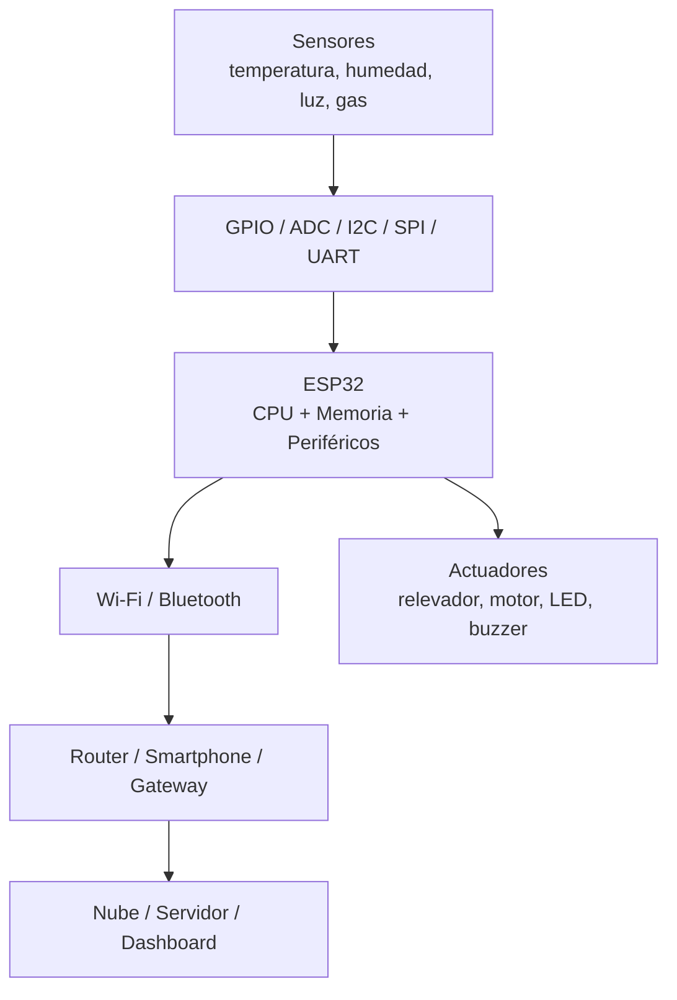
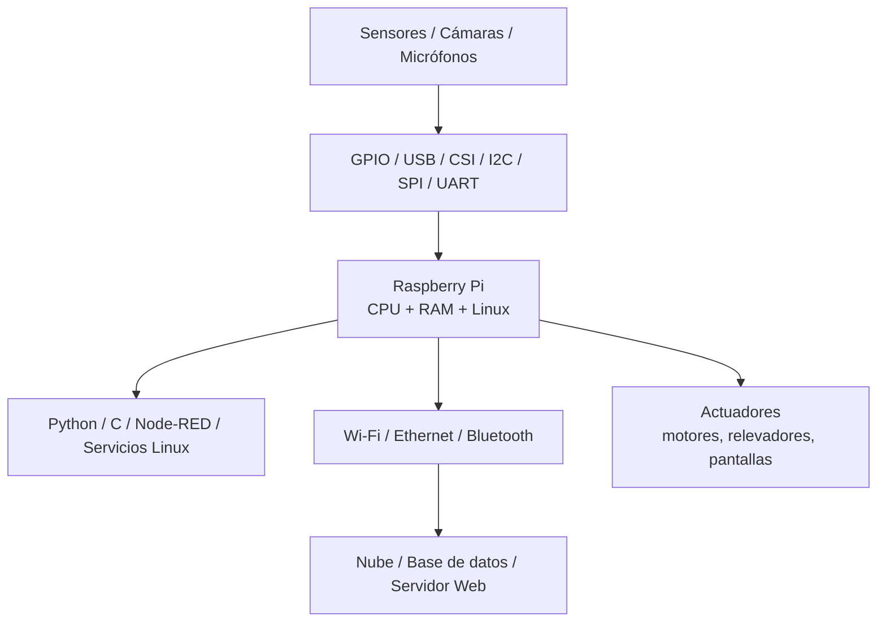
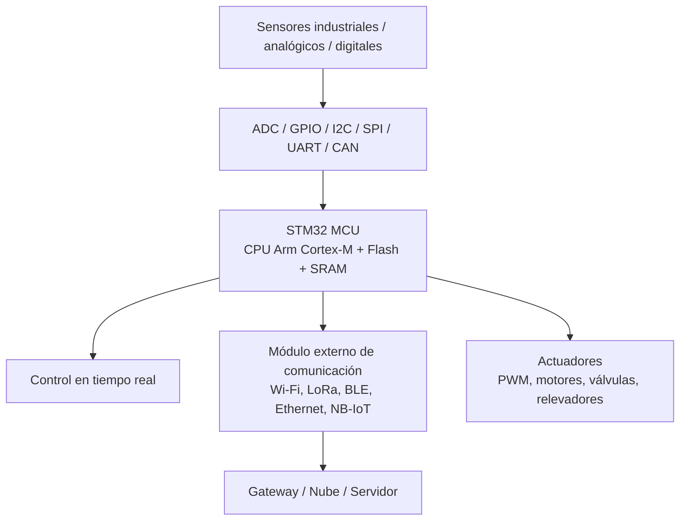
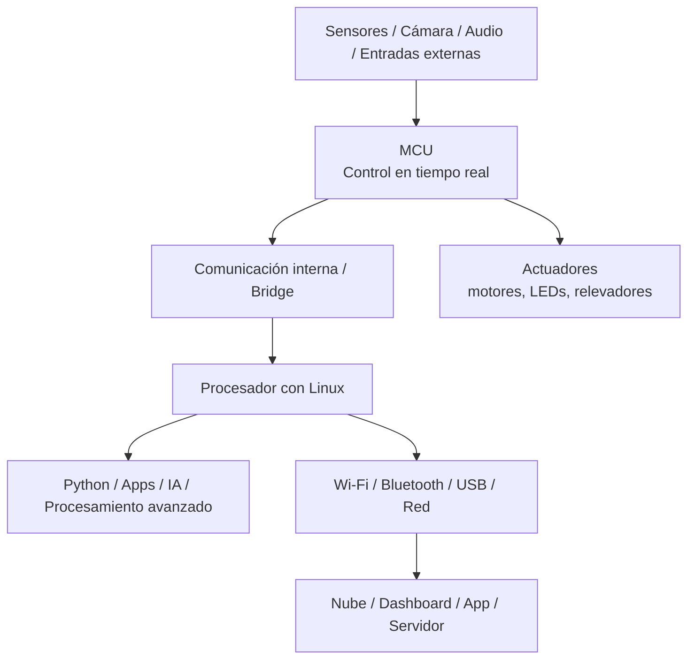
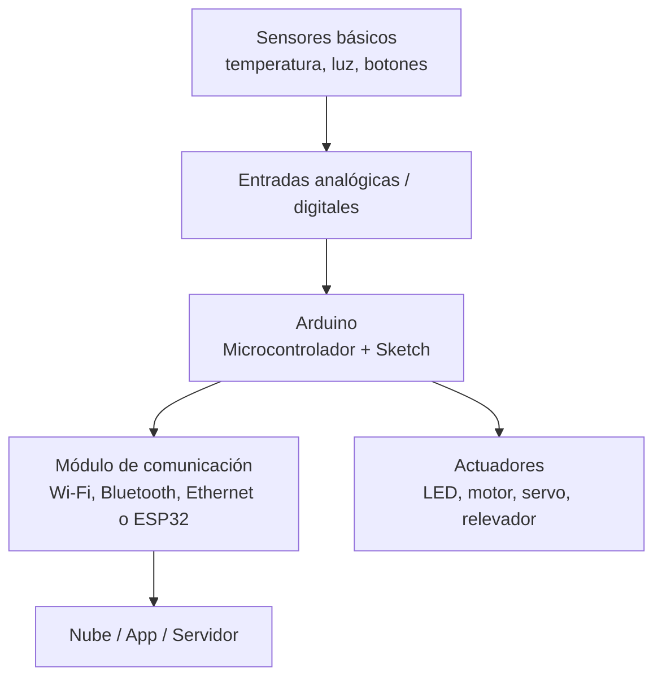
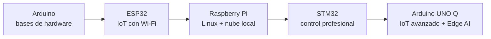

# Sistemas Embebidos con Aplicaciones IoT

## Material introductorio para alumnos de Sistemas Computacionales  
**Escuela Superior de Cómputo — Instituto Politécnico Nacional**

---

## 1. ¿Qué es un sistema embebido para IoT?

Un **sistema embebido** es un sistema de cómputo diseñado para realizar una función específica dentro de un producto, dispositivo o proceso. A diferencia de una computadora personal, normalmente no está pensado para uso general, sino para controlar, medir, comunicar o automatizar una tarea concreta.

Cuando ese sistema se conecta a internet o a una red para enviar, recibir o procesar información, entra en el campo de **IoT**, es decir, **Internet of Things** o **Internet de las Cosas**.

Un sistema embebido para IoT normalmente integra:

### Ejemplo sencillo

Un sistema IoT para monitorear temperatura podría tener:

- Sensor de temperatura.
- Microcontrolador ESP32.
- Comunicación Wi-Fi.
- Envío de datos a una plataforma web.
- Visualización desde una aplicación o dashboard.
- Activación de un ventilador si la temperatura sube.

La idea central es:

> **Medir → Procesar → Comunicar → Actuar**

---

## 2. Plataformas propuestas

Las plataformas consideradas para iniciar el curso son:

- ESP32.
- Raspberry Pi.
- STM32.
- Arduino UNO Q.
- Arduino clásico.

Los lenguajes considerados son:

- Python.
- C.
- Arduino/C++.

---

# 3. ESP32

El **ESP32** es una plataforma muy útil para cursos de IoT porque integra procesamiento, entradas/salidas, Wi-Fi y Bluetooth en un solo dispositivo. Esto permite desarrollar sistemas conectados sin requerir demasiados componentes externos.

## Diagrama a bloques del ESP32 para IoT

## Descripción

El ESP32 es ideal para iniciar con proyectos IoT porque reduce la cantidad de hardware externo. Con una sola tarjeta se pueden leer sensores, controlar actuadores y enviar información por Wi-Fi.

Para alumnos de Sistemas Computacionales, el ESP32 permite relacionar programación en **C, Arduino o MicroPython/Python** con conceptos de redes, protocolos, sensores, actuadores y sistemas en tiempo real.

## Aplicaciones sugeridas

- Estación meteorológica IoT.
- Control de luces por Wi-Fi.
- Cerradura inteligente.
- Monitoreo de calidad del aire.
- Nodo sensor para laboratorio.

---

# 4. Raspberry Pi

La **Raspberry Pi** pertenece al mundo de las **single-board computers**, es decir, computadoras de una sola tarjeta. A diferencia de un microcontrolador tradicional, puede ejecutar un sistema operativo completo, normalmente Linux.

## Diagrama a bloques de Raspberry Pi para IoT

## Descripción

Raspberry Pi es más potente que un microcontrolador tradicional porque puede ejecutar Linux completo. Esto la hace adecuada para aplicaciones IoT que requieren procesamiento más avanzado, almacenamiento local, bases de datos, visión artificial, servidores web o integración con servicios en la nube.

Para los alumnos, Raspberry Pi permite conectar el mundo de **sistemas operativos, redes, Python, servidores, bases de datos y hardware físico**.

## Aplicaciones sugeridas

- Servidor IoT local.
- Cámara de vigilancia inteligente.
- Gateway entre sensores y nube.
- Dashboard web para monitoreo.
- Procesamiento de imágenes con Python.

---

# 5. STM32

La familia **STM32** está formada por microcontroladores de 32 bits basados en procesadores Arm Cortex-M. Es una plataforma muy usada en aplicaciones profesionales, industriales y de bajo consumo.

## Diagrama a bloques de STM32 para IoT

## Descripción

STM32 es una excelente plataforma para enseñar sistemas embebidos más profesionales. A diferencia de Arduino, normalmente se trabaja más cerca del hardware: registros, temporizadores, interrupciones, ADC, PWM, DMA, comunicación serial y depuración.

Para IoT, un STM32 puede conectarse a internet mediante módulos externos o mediante tarjetas que ya integran conectividad. Es muy útil cuando se quiere enseñar control en tiempo real, bajo consumo y diseño más cercano a aplicaciones industriales.

## Aplicaciones sugeridas

- Control de motores con monitoreo remoto.
- Sensor industrial con comunicación LoRa o Wi-Fi.
- Sistema de adquisición de datos.
- Nodo de bajo consumo alimentado por batería.
- Prototipo de control embebido profesional.

---

# 6. Arduino UNO Q

El **Arduino UNO Q** puede entenderse como una plataforma híbrida, ya que combina una parte tipo microcontrolador para tareas de control en tiempo real y una parte con Linux para procesamiento más avanzado.

## Diagrama a bloques de Arduino UNO Q para IoT

## Descripción

Arduino UNO Q es interesante para un curso moderno porque permite explicar una arquitectura de “dos cerebros”:

- Un **microcontrolador** para tareas de control, lectura de sensores y respuesta rápida.
- Un **microprocesador con Linux** para procesamiento más pesado, Python, aplicaciones, visión, audio o inteligencia artificial ligera.

Esto la coloca entre Arduino clásico y Raspberry Pi. Puede ser una buena plataforma para proyectos de IoT avanzado o Edge AI, donde se requiere controlar hardware y al mismo tiempo procesar datos localmente.

## Aplicaciones sugeridas

- Cámara inteligente con control físico.
- Robot con procesamiento local.
- Sistema IoT con dashboard embebido.
- Clasificación de audio o imagen en el borde.
- Proyecto educativo de “MCU + Linux + IoT”.

---

# 7. Arduino clásico

Arduino es una de las plataformas más accesibles para iniciar en electrónica, programación y prototipado. Es muy útil para que los alumnos comprendan la relación directa entre software y hardware.

## Diagrama a bloques de Arduino para IoT

## Descripción

Arduino es ideal para la etapa inicial del curso porque permite que los alumnos entiendan rápidamente la relación entre código y hardware. El modelo de programación con `setup()` y `loop()` facilita introducir entradas, salidas, sensores y actuadores.

Para IoT, Arduino puede usarse con módulos externos de comunicación o con tarjetas que ya integran conectividad, como Arduino UNO R4 WiFi.

## Aplicaciones sugeridas

- Encendido automático de luces.
- Sensor de temperatura con envío de datos.
- Control de servomotor desde una app.
- Sistema de riego básico.
- Prototipo rápido de sensores.

---

# 8. Comparación didáctica inicial

| Plataforma | Tipo | Sistema operativo | Lenguajes recomendados | Nivel recomendado | Uso principal |
|---|---|---|---|---|---|
| ESP32 | Microcontrolador con conectividad | No requiere Linux | Arduino, C, MicroPython | Inicial-intermedio | IoT directo con Wi-Fi/Bluetooth |
| Raspberry Pi | Computadora embebida/SBC | Linux | Python, C, Bash | Intermedio | Servidores, gateways, visión, dashboards |
| STM32 | Microcontrolador profesional | Bare-metal / RTOS | C, C++ | Intermedio-avanzado | Control en tiempo real e industrial |
| Arduino UNO Q | Híbrido MCU + Linux | Linux + entorno MCU | Python, C/C++, Arduino | Intermedio-avanzado | IoT avanzado, Edge AI, control + cómputo |
| Arduino clásico | Microcontrolador educativo | No requiere Linux | Arduino/C++ | Inicial | Introducción a sensores y actuadores |

---

# 9. Secuencia sugerida para el curso

## Módulo 1: Introducción a sistemas embebidos e IoT

**Objetivo:** comprender qué es un sistema embebido, qué es IoT y cuáles son sus bloques principales.

### Temas

- Sensores.
- Actuadores.
- Microcontroladores.
- Comunicación.
- Nube.
- Protocolos.
- Energía.
- Seguridad básica.

---

## Módulo 2: Arduino clásico

**Objetivo:** entender entradas, salidas y lógica básica de control.

### Proyecto sugerido

> Sistema de alarma con sensor, LED, buzzer y botón.

---

## Módulo 3: ESP32

**Objetivo:** conectar el sistema embebido a internet.

### Proyecto sugerido

> Estación de temperatura y humedad con envío de datos por Wi-Fi.

---

## Módulo 4: Raspberry Pi

**Objetivo:** usar Linux, Python y servicios web en IoT.

### Proyecto sugerido

> Dashboard local para visualizar datos de sensores.

---

## Módulo 5: STM32

**Objetivo:** introducir control profesional en tiempo real.

### Proyecto sugerido

> Sistema de adquisición de datos con ADC, interrupciones y comunicación serial.

---

## Módulo 6: Arduino UNO Q

**Objetivo:** integrar control en tiempo real con procesamiento avanzado.

### Proyecto sugerido

> Sistema IoT inteligente que detecta eventos, procesa datos localmente y activa actuadores.

---

# 10. Ruta de aprendizaje propuesta

---

# 11. Idea central para presentar a los alumnos

> Un sistema embebido para IoT no es solamente una tarjeta programable; es la integración de hardware, software, sensores, comunicación y procesamiento para resolver un problema real del entorno físico.

---

# 12. Posible objetivo general del curso

Diseñar, implementar y evaluar sistemas embebidos con aplicaciones IoT utilizando plataformas de microcontroladores y computadoras embebidas, integrando sensores, actuadores, comunicación inalámbrica, programación en C/Python/Arduino y visualización de datos para resolver problemas reales de monitoreo, control y automatización.

---

# 13. Posibles competencias a desarrollar

Al finalizar esta unidad o curso, el alumno será capaz de:

- Identificar los bloques principales de un sistema embebido aplicado a IoT.
- Diferenciar entre microcontroladores, computadoras embebidas y sistemas híbridos.
- Programar sensores y actuadores usando Arduino, C o Python.
- Comunicar dispositivos embebidos mediante Wi-Fi, Bluetooth, UART, SPI o I2C.
- Enviar datos a una aplicación, servidor, dashboard o plataforma en la nube.
- Seleccionar una plataforma adecuada según los requerimientos de una aplicación IoT.
- Desarrollar prototipos funcionales de monitoreo, control y automatización.

