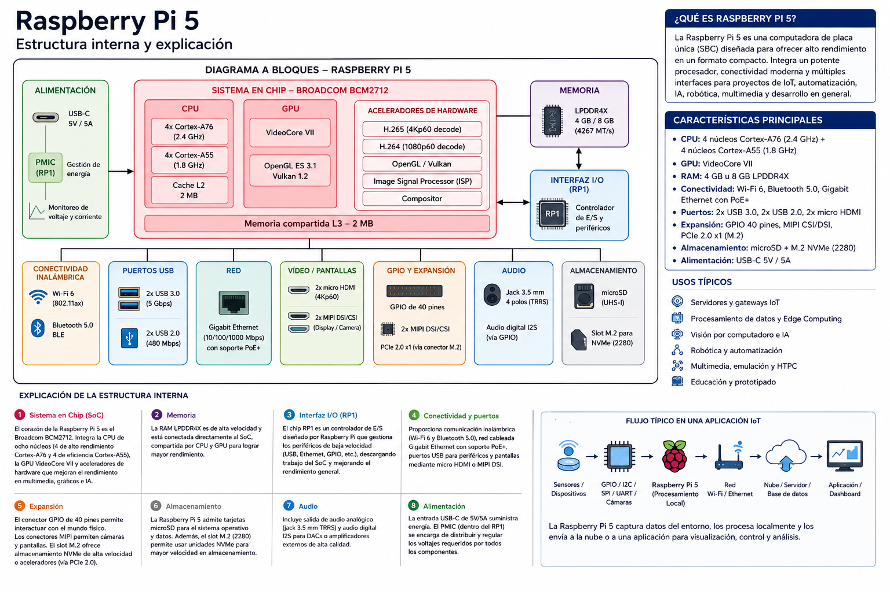
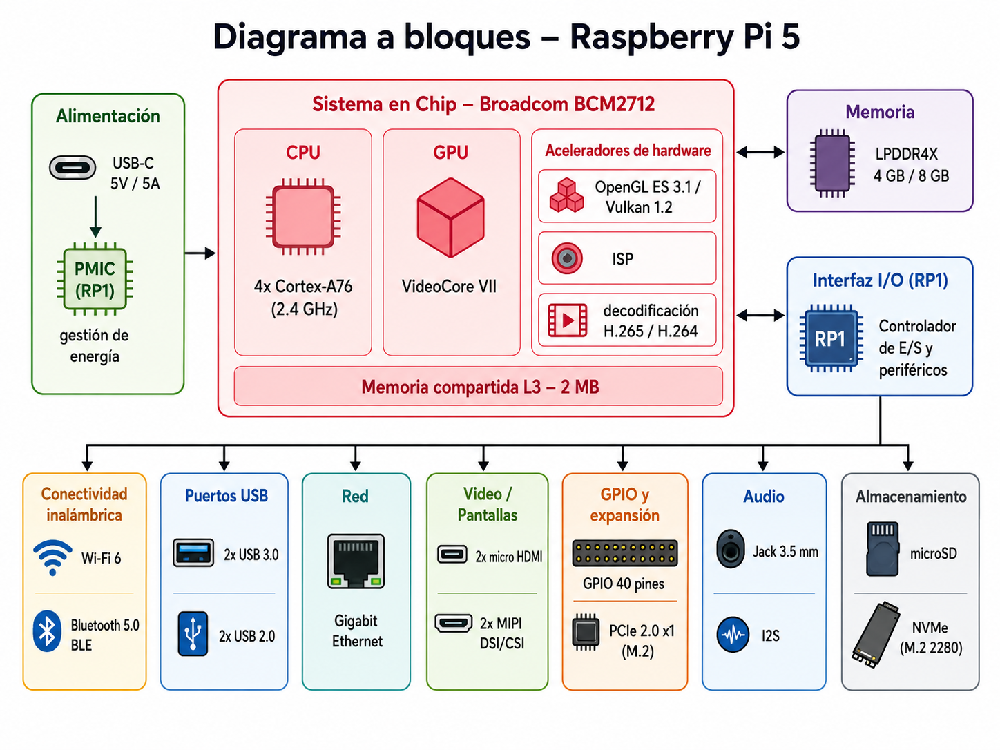
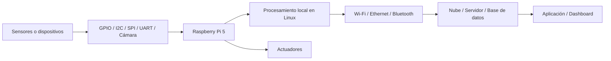

# Raspberry Pi 5: estructura interna y explicación para aplicaciones IoT

## Propósito del material

Este documento presenta una explicación didáctica de la **Raspberry Pi 5** orientada a estudiantes de **Sistemas Computacionales** que están iniciando en **sistemas embebidos con aplicaciones IoT**.

La Raspberry Pi 5 puede entenderse como una computadora embebida de una sola placa que permite conectar sensores, actuadores, cámaras, pantallas, redes y servicios en la nube. A diferencia de un microcontrolador tradicional, puede ejecutar un sistema operativo Linux y aplicaciones más complejas.

---

## Imagen original completa

La siguiente imagen corresponde a la infografía completa generada inicialmente. Incluye el diagrama a bloques, características principales, explicación general y flujo típico de una aplicación IoT.

---

## Diagrama a bloques separado

La siguiente imagen contiene únicamente el **diagrama a bloques** de la estructura interna de la Raspberry Pi 5, separado de la infografía completa para usarlo en clase, diapositivas o documentos técnicos.

---

# ¿Qué es la Raspberry Pi 5?

La **Raspberry Pi 5** es una **computadora de placa única**, también conocida como **SBC** por sus siglas en inglés: *Single-Board Computer*. Esto significa que integra en una sola tarjeta varios elementos que normalmente encontraríamos en una computadora: procesador, memoria, puertos de comunicación, almacenamiento, video, audio y conectividad.

En aplicaciones de **IoT**, la Raspberry Pi 5 puede utilizarse como:

- nodo de procesamiento local,
- gateway IoT,
- servidor web o servidor MQTT,
- sistema de adquisición de datos,
- plataforma para visión por computadora,
- interfaz entre sensores, actuadores y servicios en la nube.

En términos simples, la Raspberry Pi 5 funciona como una computadora pequeña capaz de interactuar con el mundo físico.

---

# 1. Sistema en Chip: Broadcom BCM2712

El bloque central del diagrama es el **Sistema en Chip**, también llamado **SoC**. En la Raspberry Pi 5 este bloque corresponde al **Broadcom BCM2712**.

El SoC es el corazón de la tarjeta porque concentra la mayor parte del procesamiento del sistema. Dentro de este bloque se encuentran la CPU, la GPU, aceleradores de hardware y memoria compartida.

---

## CPU

La CPU es la unidad que ejecuta el sistema operativo y los programas del usuario.

En la Raspberry Pi 5, la CPU está basada en núcleos **Arm Cortex-A76**. Estos núcleos permiten ejecutar tareas como:

- programas en Python,
- aplicaciones en C/C++,
- servicios de Linux,
- servidores web,
- clientes MQTT,
- procesamiento de datos,
- algoritmos de control,
- aplicaciones de visión o inteligencia artificial ligera.

Para un curso de sistemas embebidos, este bloque permite explicar cómo una computadora pequeña puede ejecutar software de alto nivel y al mismo tiempo interactuar con hardware externo.

---

## GPU

La GPU se encarga del procesamiento gráfico y multimedia. En el diagrama aparece como **VideoCore VII**.

Este bloque es útil cuando la aplicación necesita:

- salida de video,
- interfaz gráfica,
- reproducción multimedia,
- dashboards locales,
- visualización de datos,
- procesamiento gráfico.

Aunque en muchos proyectos IoT la GPU no es el bloque principal, es importante cuando se desea mostrar información en una pantalla o trabajar con imágenes.

---

## Aceleradores de hardware

Los aceleradores de hardware son bloques especializados que realizan ciertas tareas de forma más eficiente que la CPU general.

En el diagrama se muestran funciones como:

- gráficos con OpenGL ES / Vulkan,
- procesamiento de imagen mediante ISP,
- decodificación de video H.265 / H.264.

Estos bloques son especialmente útiles en aplicaciones de:

- cámaras inteligentes,
- visión por computadora,
- monitoreo visual,
- análisis de video,
- multimedia embebida.

---

## Memoria compartida L3

Dentro del SoC también aparece una memoria compartida de tipo **L3**. Esta memoria sirve como una zona rápida de intercambio de información entre los bloques internos del procesador.

Su función principal es mejorar el rendimiento al reducir el tiempo necesario para acceder a ciertos datos.

---

# 2. Memoria principal

El bloque de **memoria** representa la RAM de la Raspberry Pi 5. Esta memoria se utiliza mientras el sistema está encendido y ejecutando programas.

En una aplicación IoT, la memoria permite mantener activos varios procesos al mismo tiempo, por ejemplo:

- programa de adquisición de datos,
- servidor web,
- base de datos local,
- servicio MQTT,
- interfaz gráfica,
- scripts de Python,
- procesamiento de imágenes.

A diferencia de un microcontrolador como ESP32 o Arduino, la Raspberry Pi 5 puede ejecutar múltiples procesos porque trabaja con un sistema operativo completo.

---

# 3. Interfaz I/O: RP1

El bloque **RP1** es un controlador de entrada/salida diseñado para manejar varios periféricos de la tarjeta.

Puede verse como un puente entre el procesador principal y los conectores físicos de la Raspberry Pi 5.

Este bloque ayuda a administrar:

- USB,
- GPIO,
- cámaras,
- pantallas,
- red,
- almacenamiento,
- interfaces de expansión.

Desde el punto de vista didáctico, el RP1 permite explicar que una computadora embebida no solamente necesita un procesador potente, sino también controladores que organicen la comunicación con el exterior.

---

# 4. Alimentación

El bloque de **alimentación** muestra la entrada de energía por **USB-C** y la administración interna mediante un circuito de gestión de energía.

La alimentación es fundamental porque la Raspberry Pi 5 requiere una fuente estable para funcionar correctamente.

Una fuente insuficiente puede provocar:

- reinicios inesperados,
- pérdida de conexión,
- errores en periféricos USB,
- bajo rendimiento,
- corrupción de datos en almacenamiento.

En proyectos de laboratorio es recomendable explicar que la parte eléctrica no es secundaria: un sistema embebido confiable necesita una alimentación adecuada.

---

# 5. Conectividad inalámbrica

La Raspberry Pi 5 integra conectividad inalámbrica, lo que permite comunicarla con redes y dispositivos cercanos.

Este bloque incluye:

- **Wi-Fi**
- **Bluetooth / BLE**

En una aplicación IoT, esta conectividad permite:

- enviar datos a la nube,
- recibir comandos desde una aplicación,
- conectarse a sensores externos,
- crear interfaces con teléfonos móviles,
- comunicar varios nodos entre sí.

---

# 6. Puertos USB

Los puertos USB permiten conectar dispositivos externos de manera sencilla.

Algunos ejemplos son:

- teclado,
- mouse,
- cámara USB,
- memoria externa,
- adaptadores seriales,
- sensores USB,
- tarjetas de adquisición.

En proyectos IoT, los USB pueden servir para ampliar las capacidades de la Raspberry Pi sin diseñar hardware adicional.

---

# 7. Red Ethernet

El bloque de red representa la conexión cableada mediante **Ethernet**.

Ethernet es muy útil cuando se requiere una conexión más estable que Wi-Fi. Por eso se recomienda en aplicaciones como:

- servidores IoT,
- gateways,
- laboratorios,
- sistemas de monitoreo continuo,
- aplicaciones industriales,
- comunicación con bases de datos locales.

En una práctica educativa, Ethernet permite montar una arquitectura cliente-servidor o conectar la Raspberry Pi a una red institucional.

---

# 8. Video y pantallas

El bloque de video permite conectar monitores, pantallas o cámaras.

La Raspberry Pi 5 puede utilizarse con:

- salidas micro HDMI,
- interfaces para pantalla,
- interfaces para cámara.

Esto permite desarrollar proyectos como:

- sistemas de monitoreo visual,
- dashboards en pantalla,
- cámaras inteligentes,
- visión por computadora,
- kioscos informativos,
- interfaces gráficas locales.

---

# 9. GPIO y expansión

El bloque **GPIO y expansión** es uno de los más importantes para sistemas embebidos.

Los pines GPIO permiten conectar la Raspberry Pi 5 con elementos externos como:

- sensores,
- botones,
- LEDs,
- relevadores,
- motores,
- pantallas pequeñas,
- módulos de comunicación.

También permiten usar protocolos como:

- I2C,
- SPI,
- UART,
- PWM.

Este bloque conecta directamente el software con el mundo físico.

Por ejemplo, un programa en Python puede leer un sensor conectado por I2C y activar un relevador mediante un pin GPIO.

---

# 10. Audio

El bloque de audio permite utilizar salida de audio analógica o audio digital mediante interfaces como I2S.

Puede usarse en proyectos como:

- alarmas,
- asistentes de voz,
- reproducción de mensajes,
- análisis de sonido,
- interfaces auditivas.

---

# 11. Almacenamiento

La Raspberry Pi 5 utiliza almacenamiento para guardar el sistema operativo, los programas y los datos.

El almacenamiento puede estar en:

- tarjeta microSD,
- unidad NVMe mediante expansión M.2.

La microSD es suficiente para prácticas básicas, mientras que NVMe resulta más adecuado para proyectos que requieren mayor velocidad o confiabilidad.

En aplicaciones IoT, el almacenamiento puede usarse para:

- guardar mediciones,
- registrar eventos,
- almacenar imágenes,
- conservar bases de datos locales,
- ejecutar el sistema operativo.

---

# Flujo típico de una aplicación IoT con Raspberry Pi 5

Un sistema IoT basado en Raspberry Pi 5 puede seguir el siguiente flujo:

## Ejemplo de funcionamiento

Un sistema de monitoreo ambiental podría trabajar así:

1. Un sensor mide temperatura, humedad y calidad del aire.
2. La Raspberry Pi 5 recibe los datos mediante I2C, UART o GPIO.
3. Un programa en Python procesa los datos.
4. Los datos se almacenan localmente o se envían por Wi-Fi/Ethernet.
5. Un dashboard muestra las mediciones.
6. Si se supera un umbral, la Raspberry Pi activa un actuador o genera una alerta.

---

# Comparación rápida con un microcontrolador

| Característica | Raspberry Pi 5 | Microcontrolador típico |
|---|---|---|
| Sistema operativo | Linux | Normalmente no usa sistema operativo completo |
| Programación | Python, C, C++, Bash, servicios Linux | C, C++, Arduino, MicroPython |
| Procesamiento | Alto | Bajo a medio |
| Consumo de energía | Mayor | Menor |
| Tiempo real | No ideal sin ajustes especiales | Más adecuado |
| Conectividad | Wi-Fi, Bluetooth, Ethernet | Depende del modelo o módulos externos |
| Aplicaciones | Gateways, visión, dashboards, servidores | Sensores, actuadores, control directo |

---

# Resumen de bloques principales

| Bloque | Función principal |
|---|---|
| SoC Broadcom BCM2712 | Procesamiento principal |
| CPU | Ejecuta Linux y programas |
| GPU | Procesamiento gráfico y multimedia |
| Aceleradores | Mejoran gráficos, imagen y video |
| Memoria RAM | Guarda datos y procesos en ejecución |
| RP1 | Controla periféricos de entrada/salida |
| Alimentación | Regula y distribuye energía |
| Wi-Fi / Bluetooth | Comunicación inalámbrica |
| USB | Conexión de periféricos |
| Ethernet | Comunicación cableada estable |
| Video / Pantallas | Conexión de monitores, cámaras y pantallas |
| GPIO / Expansión | Interacción con sensores y actuadores |
| Audio | Salida o procesamiento de sonido |
| Almacenamiento | Sistema operativo, programas y datos |

---

# Idea clave para los alumnos

La Raspberry Pi 5 es una plataforma muy útil para IoT porque combina la flexibilidad de una computadora con la capacidad de interactuar con hardware físico.

Puede utilizarse para enseñar cómo se integran:

> **sensores + procesamiento local + Linux + comunicación + nube + visualización + actuadores**

En un curso de sistemas embebidos, la Raspberry Pi 5 ayuda a conectar temas de hardware, programación, redes, sistemas operativos y aplicaciones reales de IoT.

---

# Aplicaciones sugeridas

Algunos proyectos adecuados para estudiantes son:

- Gateway IoT con sensores ESP32 o Arduino.
- Dashboard local para monitoreo de variables ambientales.
- Servidor MQTT en red local.
- Cámara inteligente con procesamiento en Python.
- Sistema de adquisición de datos con base de datos local.
- Control de actuadores desde una interfaz web.
- Nodo de edge computing para análisis local.
- Sistema de monitoreo para laboratorio o aula inteligente.

---

# Conclusión

La Raspberry Pi 5 no debe verse solamente como una computadora pequeña. En el contexto de sistemas embebidos e IoT, puede funcionar como una plataforma de integración donde convergen hardware, software, redes y procesamiento de datos.

Su principal ventaja educativa es que permite a los alumnos construir sistemas completos: desde la lectura de sensores hasta la visualización de información en una aplicación o dashboard.
